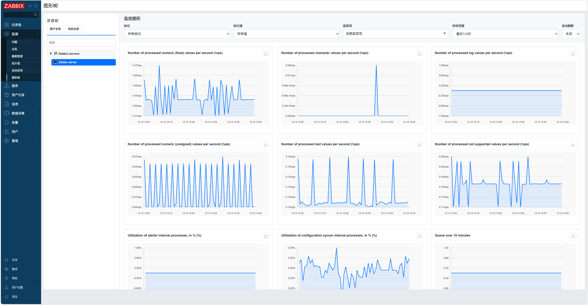

# Zabbix Graph Trees Module

[中文](README.md)

## ✨ Version Compatibility

This module is compatible with Zabbix 6.0 and 7.0+ versions.

- ✅ Zabbix 6.0.x
- ✅ Zabbix 7.0.x
- ✅ Zabbix 7.4.x

**Compatibility Note**: The module includes intelligent version detection that automatically adapts to different Zabbix API versions and class libraries, requiring no manual configuration.

## Description

This is a frontend module for Zabbix that provides tree-structured browsing of monitoring data, featuring host group tree navigation, item filtering, and real-time chart display. The module adds a Graph Trees menu under the Monitoring section of Zabbix Web.



## Features

- **Tree-structured Resource Browsing**:
  - Host group hierarchical display
  - Host list display
  - Quick search positioning
  - Expand/collapse control
- **Tag Filtering**:
  - Filter items by tags and tag values
  - Multi-select dropdown for flexible chart selection
- **Chart Display**:
  - SVG line charts for real-time monitoring data display
  - Synchronized tooltip display across multiple charts
  - Full-screen chart zoom view
  - Auto-refresh functionality (5/10/20/30/60 second intervals)
  - Multiple time range selections (1 hour to 30 days)
- **Internationalization**: Support for Chinese and English interfaces
- **Responsive Design**: Adapts to different screen sizes

## Installation Steps

### Install Module

```bash
# Zabbix 6.0 / 7.0 deployment method
git clone https://github.com/X-Mars/zabbix_modules.git /usr/share/zabbix/modules/

# Zabbix 7.4 deployment method
git clone https://github.com/X-Mars/zabbix_modules.git /usr/share/zabbix/ui/modules/
```

### ⚠️ Modify manifest.json File

```bash
# ⚠️ For Zabbix 6.0, modify manifest_version
sed -i 's/"manifest_version": 2.0/"manifest_version": 1.0/' zabbix_graphtrees/manifest.json
```

### Enable Module

1. Go to **Administration → General → Modules**.
2. Click **Scan directory** to scan for new modules.
3. Find "Zabbix Graph Trees" module and enable it.
4. Refresh the page, the module will appear under the **Monitoring** menu as "Graph Trees" submenu.

## Notes

- **Performance Considerations**: For large environments, consider limiting query result quantities appropriately.
- **Data Accuracy**: Displayed information is based on the current state of the Zabbix database.
- **Item Dependencies**: Chart display depends on corresponding item configuration.

## Development

The plugin is developed based on the Zabbix module framework. File structure:

- `manifest.json`: Module configuration
- `Module.php`: Menu registration
- `actions/GraphTrees.php`: Graph trees business logic processing
- `actions/GraphTreesData.php`: Data acquisition business logic processing
- `views/graphtrees.php`: Graph trees page view
- `lib/LanguageManager.php`: Internationalization language management
- `lib/ViewRenderer.php`: View rendering utilities
- `lib/ZabbixVersion.php`: Version compatibility tools

For extensions, refer to [Zabbix module documentation](https://www.zabbix.com/documentation/7.0/en/devel/modules).

## License

This project follows the Zabbix license. For details, see [Zabbix License](https://www.zabbix.com/license).

## Contributing

Issues and improvement suggestions are welcome.